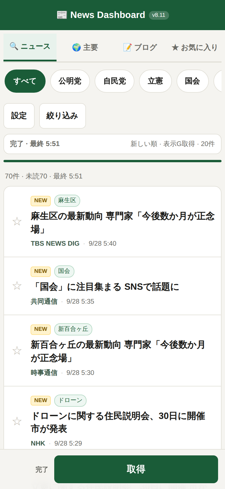
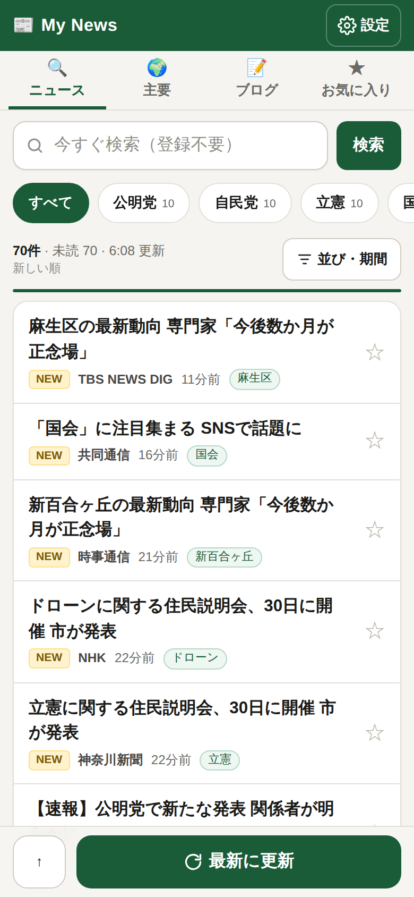
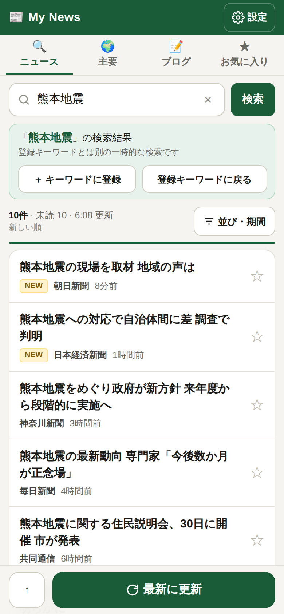

# UI/UX レビューと改修（2026-09-28、v8.11 → v9.0）

読者：このリポジトリの画面を次に直す人（エージェント・将来の自分）。利用者への説明にも使える。

## 確認のしかた

外部の RSS に届かない環境だったため、本物の `api/rss.js`（`createHandler`）に疑似 RSS を返すクライアントを渡したローカルサーバーを立て、
Chromium（Playwright）でスマホ幅 390px と PC 幅 1280px の画面を撮影・操作して確認した。
記事の見出しや媒体名は疑似データで、実際の取得先の返す内容は確認していない（本番での確認は未実施）。

| 改修前 | 改修後 | クイック検索 |
|---|---|---|
|  |  |  |

## 見つけた問題（重い順）

| # | 問題 | 利用者への影響 | 対応 |
|---|---|---|---|
| 1 | 開くたびに何も表示されず、「取得」を押すまで空 | 毎回1タップ余計。初めての人は何をすればよいか迷う | 開いたとき・タブを初めて開いたときに自動で取得 |
| 2 | スマホで記事の上にヘッダー・タブ・キーワード・設定ボタン・状態欄・件数行が縦に積み重なる | 390×844 の画面で、下部バーに隠れず全体が見える記事は3本（最初の記事の上端 321px） | ヘッダーを細くし設定ボタンを右上へ。状態欄と件数行を1行に統合し、記事行も詰めた。検索欄を足したうえで 5本（上端 273px）。Playwright で計測 |
| 3 | 絞り込みシートに「取得範囲」が2つ出る（PC用とスマホ用の両方が表示されていた） | 不具合に見える | スマホ用の複製をやめ、1組の設定だけにした |
| 4 | 状態が3か所に出る（状態欄「完了・最終5:51」、件数行「70件・未読70・最終5:51」、下部バー「完了」） | 情報が重複し、どれを見ればよいか分からない | 「70件 · 未読 70 · 5:51 更新」の1か所に集約 |
| 5 | 記事行で NEW・キーワードの札が見出しの上に1行を使う | 見出しが下にずれ、流し読みしにくい | 見出しを先頭に。札・媒体・時刻は下の1行へ |
| 6 | 日時が「9/28 5:40」の絶対時刻 | 新しさを計算しないと分からない | 「11分前」「3時間前」「昨日 14:20」の相対表示（ホバーで正確な日時） |
| 7 | 設定の「保存」「削除」が「保/存」「削/除」と縦に折り返す。グループ選択が「（グループ」で切れる | 読めない・押しにくい | 配置を組み直し、ボタン文言を「名前を付けて保存」等に |
| 8 | 灰色ボタン（`btn-secondary`）が無効状態に見える | 押せると気付かない | 主要操作は緑、補助は枠線ボタンに統一 |
| 9 | グループ削除・同名グループ上書きが確認なしで即実行 | 誤操作で登録内容が消える | 確認ダイアログを追加 |
| 10 | 「編集用に読み込み」という操作概念が分かりにくい | グループの使い方が伝わらない | 選択肢を選ぶだけで切り替わるように。ボタンは廃止 |
| 11 | 並び・期間が選択ボックス | 2タップ必要、今の値が見えにくい | 1タップのセグメントボタンに。既定から変えていると「並び・期間」に印 |
| 12 | 主要タブのカテゴリがシートの中の選択ボックス | ほぼ使われない位置 | ニュースのキーワードと同じ横スクロールのチップに（件数付き） |
| 13 | ブログタブの検索欄にボタンが無い（Enter のみ） | スマホで検索の仕方が分からない | 検索ボタンを追加 |
| 14 | 空・失敗・0件のメッセージに次の行動が無い。失敗時の文言「通信が混み合っています」は原因と合っていない | 行き止まりになる | それぞれに「もう一度取得する」「期間を『すべて』にする」等のボタン。更新失敗で前回の記事が残るときはトーストで知らせる |
| 15 | お気に入りタブで下部バーに取得ボタンが無く「お気に入り」とだけ出る | 意味のない帯が残る | お気に入りでは更新ボタンを隠す。「↑（先頭へ）」を追加 |
| 16 | 操作結果が状態欄の小さな文字でしか返らない（グループ保存など） | 反応が無いように見える | 画面下のトーストで知らせる |
| 17 | 入力欄の `outline: none` でキーボード操作時の位置が分からない。タブに `role`/`aria-selected` が無い | キーボード・読み上げで使いにくい | `:focus-visible` の枠、タブ・トグルの ARIA 属性を追加 |
| 18 | ダークモードが無い | 夜間にまぶしい | 端末設定に合わせて自動で切り替え（色はすべて `:root` のトークン経由に） |
| 19 | キーワードを追加しても記事は「取得」を押すまで出ない | 追加が効いたか分からない | 追加した語だけすぐ取得（取得中なら終わったあとに続けて取得） |
| 20 | Google と Bing で同じ記事が2本並ぶことがある（リンク違いのため API の重複除去を通る）。主要タブも同様 | 同じ見出しが並ぶ | 画面側で見出しを正規化して1本に |

## 追加した機能：クイック検索（登録不要）

ニュースタブ最上部の検索欄に語を入れて「検索」（または Enter）を押すと、その語だけで Google/Bing ニュースを検索して表示する。

- 登録キーワード（`myKeywords`・グループ）には一切書き込まない。緑の帯に「『〇〇』の検索結果」と出し、「登録キーワードに戻る」でいつもの一覧へ戻る
- 気に入った語は帯の「＋ キーワードに登録」で1タップ登録できる（表示中のグループに入り、いまの検索結果もそのまま使う）
- 取得件数は設定値と30件の大きいほう（1語だけなので少なすぎないように）
- 検索欄を選ぶと「最近の検索」を最大8件表示（`localStorage` の `myQuickHistory`。「履歴を消す」で消去）
- `?q=語` 付きの URL で開くとその語の検索から始まる（ホーム画面・ブックマーク用）
- PC ではどのタブからでも `/` キーで検索欄へ移動
- API は既存の `/api/rss?type=news&keyword=...` をそのまま使う。サーバー側の変更は無い。
  登録キーワードの取得と同じ `fetchKeywordItems()` を通すので、除外ワードも同じく効く

## 変えていないもの

- `api/rss.js`（取得・解析・除外・診断ヘッダー）
- `localStorage` のキーと中身（既存の登録キーワード・グループ・お気に入り・既読・通知設定はそのまま引き継がれる。新しいキーは `myQuickHistory` のみ）
- 話題順のまとめ方、主要タブのカテゴリ判定、通知の仕組み

## 残した課題

- 設定の端末間同期・書き出しは無い（従来どおり）
- 新着通知はページを開いている間だけ（従来どおり）
- 本番の実データ（長い見出し、媒体名の揺れ）での見え方は、デプロイ後に目視確認が必要
